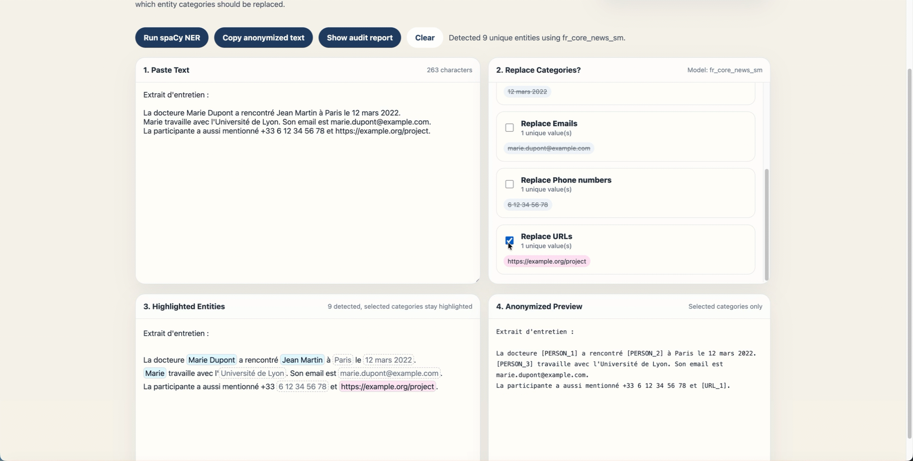

# Anonymizer for Digital Humanities (still thinking about the name)

Qualitative Text Anonymizer is a local-first desktop prototype for helping social sciences researchers review and anonymize sensitive information in pasted qualitative text.

It is designed for interview excerpts, field notes, open-ended survey responses, and similar research materials. It is an anonymization assistant, not a guarantee of complete anonymity.

## Main Functions



- Run local named entity recognition using spaCy.
- Highlight detected entities in the text.
- Review detected categories such as people, locations, organizations, dates, emails, phone numbers, URLs, and miscellaneous entities.
- Choose which entity categories should be replaced.
- Preview the anonymized text with placeholders such as `[PERSON_1]`, `[LOCATION_1]`, `[DATE_1]`, and `[EMAIL_1]`.
- Generate an **audit report** showing replacement decisions, including the exact values reviewed/replaced.

## Bundled NER Service

The macOS release includes a bundled Python/spaCy NER service built with PyInstaller.

Users of the released macOS app do not need to install Python, spaCy, or the French spaCy model separately. The app runs the bundled local NER service from inside the application package.

No text is sent to an external API by default.

## Warm-Up Time

The first NER run may take several seconds because the bundled spaCy model has to warm up.

After startup, the app keeps a persistent local NER service running in the background, so later detections should be faster. If the first detection feels slow, wait for the app to finish loading the model.

## Prototype Status

This is a research prototype.

- The app does not guarantee complete anonymization.
- Researchers should manually review the anonymized output for missed identifiers and indirect re-identification risks.
- The current packaged release is macOS only.
- The model used is the French spaCy model: `fr_core_news_sm`.

## Releases

Only the macOS release is currently published.

Download the packaged app from GitHub Releases:

- `Qualitative Text Anonymizer-0.1.0-arm64.dmg`
- `Qualitative Text Anonymizer-0.1.0-arm64-mac.zip`

The repository should contain source code only. Generated folders such as `node_modules/`, `.venv/`, `dist/`, `release/`, `python-build/`, and `python-dist/` should not be committed.

## Development

Install JavaScript dependencies:

```bash
npm install
```

Create the local Python environment for development:

```bash
python3 -m venv .venv
.venv/bin/pip install -r requirements.txt
.venv/bin/python -m spacy download fr_core_news_sm
```

Run the app in development mode:

```bash
npm run dev
```

## Build The macOS App

Build the bundled NER executable:

```bash
npm run build:ner
```

Build the macOS DMG and ZIP:

```bash
npm run dist:mac
```

Generated release files are written to:

```bash
release/
```

## Privacy Note

The app is intended for local processing. However, audit reports can include exact detected values when configured that way, so treat exported reports as sensitive research data.
